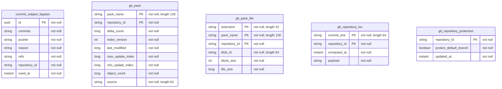

<!-- Generated by `qits database diagram` (jpa). Do not edit: the entity-diagram automation rewrites this file on every release request fold. -->
# Persistence unit `githost`

Datasource `githost` · package `eu.wohlben.qits.githost.persistence` · 5 entities

